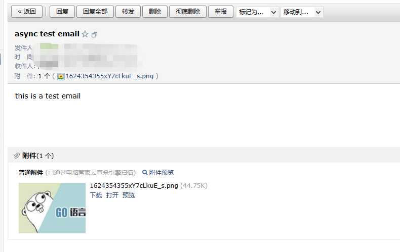

# email

## Getting started

### Documentation

```go
type Mail struct {
  host     string //smtp server host
  port     int    //smtp server port
  username string //smtp auth username
  password string //smtp auth passworld

  sender string

  callBack func(ids string, sendErr, linkErr error) //async send callback
}
```

- `AsyncSendMail()` 异步发送邮件,可以在`Mail` 中设置 callback
- `SendMail()` 发送邮件,等待发送返回


## Example broadcast

具体代码请参考`example`文件夹

1. 填写smtp服务地址端口以及认证的用户名密码

   

   

