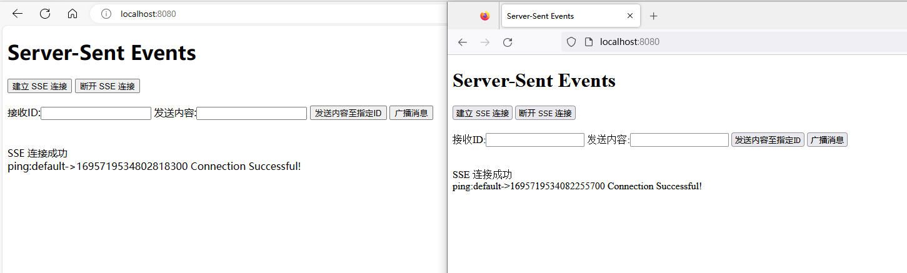
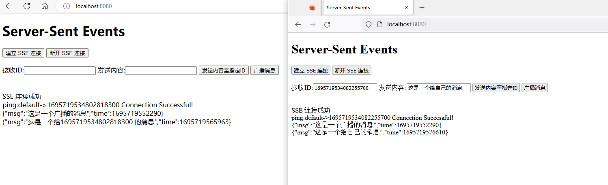
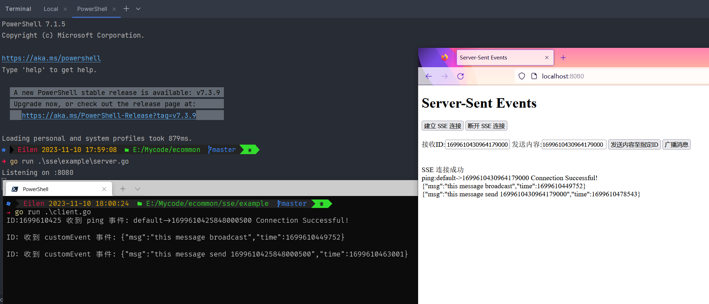

# Server-Sent Events (SSE)


## 快速开始

### Server  使用手册


#### 核心结构体

```go
// Packet server 消息包
type Packet struct {
   Message   Message `json:"message"` //发送内容消息体
   Zone      string  //类似区域概念,每个连接可以在不同区域中
   ID        string  `json:"id"` //连接ID,用于标识连接
   Broadcast bool    //是否广播
}

// Message sse消息内容
type Message struct {
	Event string //server 监听事件名称,必填
	Data  string //发送内容
}
```


#### 消息推送

[SendMessage()]() 方法发送消息 `Packet`不同参数有不同逻辑 如下:

- Zone == "" && Broadcast == true && ID== "" , `全域广播`（所有连接全部发送消息）

- Zone != "" && Broadcast == true && ID== "" , Zone正确 `并且` 存在连接时进行 `域内广播`（同意区域内全部发送消息）

- Zone != "" && ID != "" , 找到指定ID连接 进行消息发送


1. 引入包，初始化一个hub

```go
import "github.com/EilenC/ecommon/sse"
var h = sse.NewHub(nil)
```

2. 在http监听中,转给hub中的 [RegisterBlock()]() 方法处理

```go
http.HandleFunc("/server", sse)
sse := func(w http.ResponseWriter, r *http.Request) {
    h.RegisterBlock(w, r, "zone ID 可以选值 为空默认为default", nil)
}
```

3. 发送消息,使用hub中的 [SendMessage()]() 方法发送

```go
http.HandleFunc("/send", send)
send := func(w http.ResponseWriter, r *http.Request) {
	user := r.FormValue("user")
	content := r.FormValue("content")
	msg := make(map[string]interface{})
	msg["msg"] = content
	msg["time"] = time.Now().UnixMilli()
	b, _ := json.Marshal(msg)
	err := h.SendMessage(sse.Packet{
		Message: &sse.Message{
			Event: "customEvent",
			Data:  string(b),
		},
		Zone:      "default",
		ClientID:  user,
		Broadcast: user == "",
	})
	if err != nil {
		fmt.Printf("send message fail %+v\n", err)
		_, _ = w.Write([]byte(err.Error()))
		return
	}
}
```


### Client 使用手册

#### 连接服务

[NewClient()] 根据参数初始化一个Client

参数:

1. Server-sent Event 服务地址
2. 请求方法 (default:GET)
3. 断开连接后重连时间

```go
client := sse.NewClient("http://localhost:8080/sse", http.MethodGet, 3*time.Second)
client.Start()
```


#### 监听事件

```go
// 自定义事件处理逻辑
client.OnEvent("customEvent", func(event *sse.Message) {
    fmt.Printf("ID:%s 收到 %s 事件: %s\n", event.ID, event.Event, event.Data)
})
```


#### 连接成功与断开回调

```
// 连接建立时的处理逻辑
client.OnConnection(func() {
    fmt.Println("连接已建立")
})

// 连接错误时的处理逻辑
client.OnError(func(err error) {
    fmt.Println("连接错误:", err)
})
```


## 示例

### Server:

具体代码请参考`example/server.go`

1. 初始化SSE连接

   

2. 发送消息

   

   

### Client:

具体代码请参考`example/client.go`

客户端与Web端通信

   